# Despliegue de una aplicación en Python con Flask en Gunicorn

<br>

## Contenidos
- [Nginx](#nginx)  
- [Python *pip*](#python-pip)  
- [Entorno Virtual](#entorno-virtual)  
- [Gunicorn](#gunicorn)  
    - [Configuración de Nginx](#configuración-de-nginx)  
- [Tarea](#tarea)  
- [Extracción de archivos](#extracción-de-archivos)

<br>

## Nginx

Se realiza la instalación de Nginx en la provisión de la sigueinte forma:
```Vagrantfile
# -*- mode: ruby -*-
# vi: set ft=ruby :

Vagrant.configure("2") do |config|
    config.vm.define "practica" do |p|
        p.vm.box = "debian/bullseye64"
        p.vm.hostname = "practica"
        p.vm.network "forwarded_port", guest: 8080, host: 8080
        p.vm.network "private_network", ip: "192.168.11.11"
        p.vm.provision "shell", name: "nginx", inline: <<-SHELL
            apt-get update
            apt-get install -y nginx git
            mkdir -p /var/www/nginx_server/html
            chown -R www-data:www-data /var/www/nginx_server/html
            chmod -R 755 /var/www/nginx_server
            systemctl restart nginx
        SHELL
    end # practica
end # cofig
```

## Python *pip*

Actualización e instalación del gestor de paquetes:  
`sudo apt-get update && sudo apt-get install -y python3-pip`

Instalación de *pipenv*:  
`pip3 install pipenv`

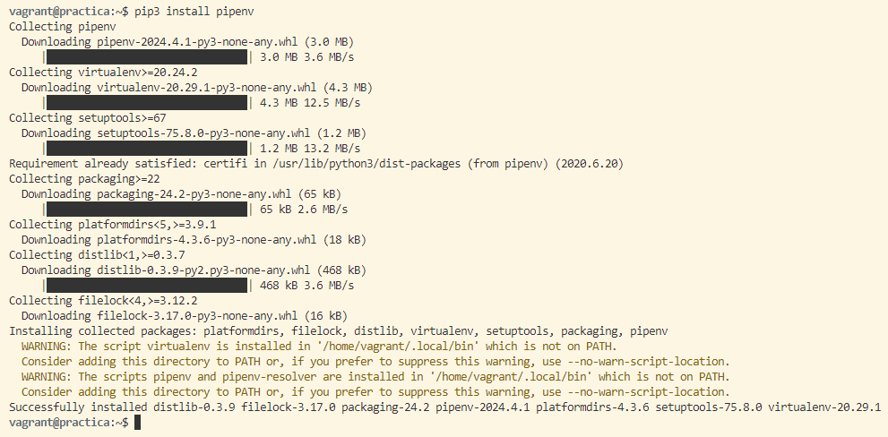

Comprobar que se ha instalado correctamente mostrando su versión:  
```bash
PATH=$PATH:/home/$USER/.local/bin
pipenv --version
```

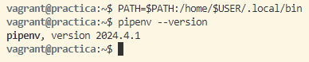

Instalación de *python-dotenv* para cargar las variables de entorno:  
`pip3 install python-dotenv`

Se crea el directorio en el que se guardará el proyecto:  
`sudo mkdir -p /var/www/pythonApp`

Se cambian el grupo y los permisos del directorio:
```bash
sudo chown -R $USER:www-data /var/www/pythonApp
sudo chmod -R 775 /var/www/pythonApp
```

Creación del archivo oculto *.env* que almacenará las variables de entorno:  
`nano /var/www/pythonApp/.env`  
Y se le añaden las variables para indicar el archivo *.pi* y el entorno:
```bash
FLASK_APP=wsgi.py
FLASK_ENV=production
```

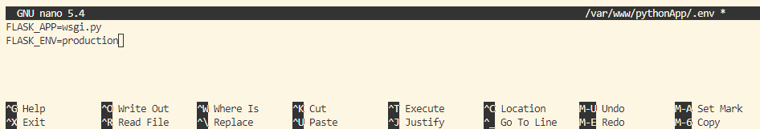

## Entorno virtual

Es necesario situarse en el directorio del proyecto:  
`cd /var/www/pythonApp`

Inicializar el entorno:  
`pipenv shell`

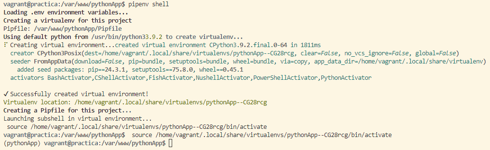

Aparecerá el nombre del entorno al inicio del prompt del shell:  
`(pythonApp) vagrant@practica:/var/www/pythonApp$`

Instalación de dependencias necesarias:  
`pipenv install flask gunicorn`

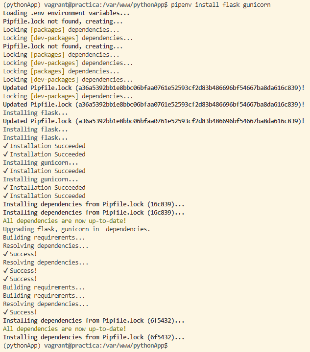

Creación de aplicación Flask a modo de prueba:  
`touch application.py wsgi.py`  
Se edita el contenido:  
`nano /var/www/pythonApp/application.py`
```python
from flask import Flask

app = Flask(__name__)

@app.route('/')
def index():
    '''Index page route'''
    return '<h1>App desplegada</h1>'
```

`nano /var/www/pythonApp/wsgi.py`
```python
from application import app

if __name__ == '__main__':
   app.run(debug=False)
```

Ejecución de la aplicación en la dirección *0.0.0.0* para que escuche en todas sus intefaces:  
`flask run --host '0.0.0.0'`

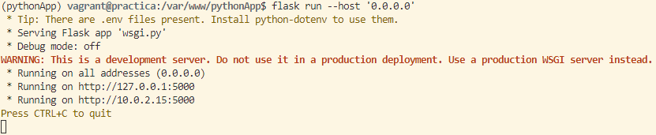

Acceso a la aplicación desde el navegador: *http://192.168.11.11:5000*

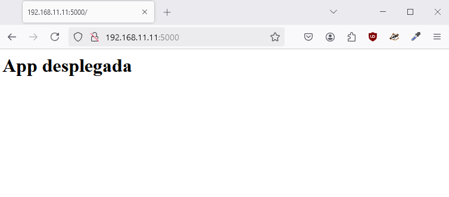

Comprobación con Gunicorn tras parar el servidor con *Ctrl+C*:  
`gunicorn --workers 4 --bind 0.0.0.0:5000 wsgi:app`  
- **--workers 4** establece el número de hilos.  
- **--bind 0.0.0.0:5000** establece la escucha por todas sus interfaces.  
- **wsgi:app** donde el primer término es el nombre del archivo *wsgi.py* y el segundo es la instancia de la aplicación Flask dentro del archivo.

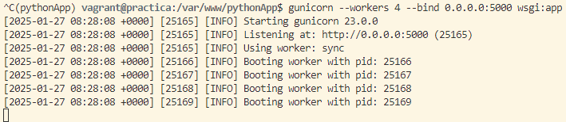

Es necesario averiguar la ruta desde la que se ejecuta *Gunicorn* en el entorno virtual, será necesaria más adelante para el servicio de *systemd* para arrancar la aplicación. Para averiguar la ruta:  
`which gunicorn`  
Respuesta:  
`/home/vagrant/.local/share/virtualenvs/pythonApp--CG28rcg/bin/gunicorn`

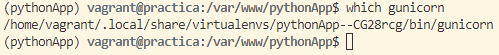

Salir del entorno virtual:  
`deactivate`

## Gunicorn

Primeramente, iniciar y comprobar Nginx:
```bash
sudo systemctl start nginx
sudo systemctl status nginx
```

Fuera del entorno virtual, se debe crear un archivo *systemd* para que Gunicorn se ejecute como un servicio más del sistema.

Creación del fichero:  
`sudo nano /etc/systemd/system/flask_app.service`  
Contenido:  
```bash
[Unit]
Description=flask app service - App con flask y Gunicorn
After=network.target
[Service]
User=vagrant
Group=www-data
Environment="PATH=/home/vagrant/.local/share/virtualenvs/pythonApp--CG28rcg/bin"
WorkingDirectory=/var/www/pythonApp
ExecStart=/home/vagrant/.local/share/virtualenvs/pythonApp--CG28rcg/bin/gunicorn --workers 3 --bind unix:/var/www/pythonApp/pythonApp.sock wsgi:app

[Install]
WantedBy=multi-user.target
```
- **User** establece el usuario con permisos sobre el directorio.  
- **Group** establece el usuario con permisos sobre el directorio.  
- **Environment** establece el directorio *bin* dentro del entorno virtual.  
- **WorkingDirectory** establece el directorio del proyecto
- **ExecStart** establece el path donde se encuentra el ejecutable de Gunicorn dentro del entorno virtual, junto a las opciones y comandos con los que se iniciará.

Se recargan los archivos de configuración de *systemd*:  
`sudo systemctl daemon-reload`

Se habilita y se inicia el servicio:
```bash
sudo systemctl enable flask_app
sudo systemctl start flask_app
```

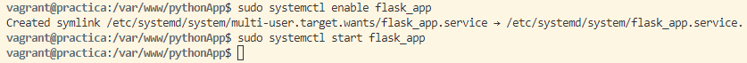

### Configuración de Nginx

Creación del archivo de cofiguración del sitio web:  
`sudo nano /etc/nginx/sites-available/app.conf`  
Contenido:
```bash
server {
  listen 80;
  server_name pythonapp.izv www.pythonapp.izv;

  access_log /var/log/nginx/app.access.log;
  error_log /var/log/nginx/app.error.log;

  location / {
    include proxy_params;
    proxy_pass http://unix:/var/www/pythonApp/pythonApp.sock;
  }
}
```

Creación del link simbólico:  
`sudo ln -s /etc/nginx/sites-available/app.conf /etc/nginx/sites-enabled/`  
Comprobación:  
`ls -l /etc/nginx/sites-enabled/ | grep app.conf`

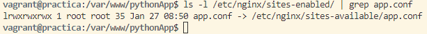

Comprobación de que la configuración de Nginx no contiene errores:  
`sudo nginx -t`

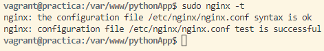

Reinicio y comprobación del servicio:
```bash
sudo systemctl restart nginx
sudo systemctl status nginx
```

Se edita el archivo /etc/hosts para que asocie la IP de la máquina virtual al servidor.  
En Windows está en el siguiente directorio:  
`C:\Windows\System32\drivers\etc\hosts`  
Se añade la asociación:  
`192.168.11.11 pythonapp.izv www.pythonapp.izv`

Se comprueba que se ha desplegado correctamente accediendo a la dirección:  
- *http://pythonapp.izv/*  
- *http://www.pythonapp.izv/*

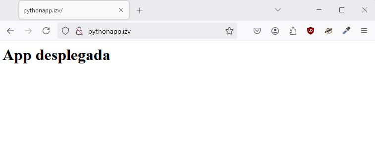

## Tarea

Inicialmente se clonará el repositorio de GitHub en */var/www*:  
`cd /var/www`  
`sudo git clone https://github.com/Azure-Samples/msdocs-python-flask-webapp-quickstart`

Activación del entorno virtual dentro del directorio del repositorio clonado:  
```bash
sudo chown -R $USER:www-data /var/www/msdocs-python-flask-webapp-quickstart

sudo chmod -R 775 /var/www/msdocs-python-flask-webapp-quickstart

nano /var/www/msdocs-python-flask-webapp-quickstart/.env

    FLASK_APP=wsgi.py
    FLASK_DEBUG=True    (si se despliega pasa a ser "False")

cd /var/www/msdocs-python-flask-webapp-quickstart

pipenv shell
```

Instalación de dependencias:  
`pipenv install -r requirements.txt`

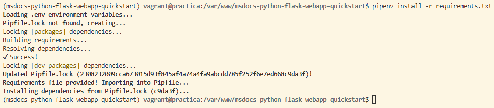

Creación de *wsgi.py*:  
`nano /var/www/msdocs-python-flask-webapp-quickstart/wsgi.py`  
```bash
from app import app

if __name__ == '__main__':
   app.run(debug=False)
```

Ejecución de la aplicacción para que escuche en todas sus interfaces:  
`flask run --host '0.0.0.0'`

Comprobación en: *http://192.168.11.11:5000*


Arranque de Gunicorn tras parar el servidor:  
`gunicorn --workers 4 --bind 0.0.0.0:5000 wsgi:app`  
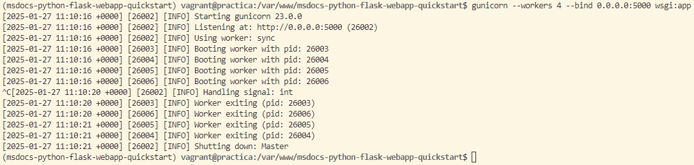

Ruta de Gunicorn:  
`which gunicorn`  
Respuesta:  
`/home/vagrant/.local/share/virtualenvs/msdocs-python-flask-webapp-quickstart-YrxIX3KC/bin/gunicorn`

Se sale del entorno virtual:  
`deactivate` o `exit`

Continuación con Gunicorn y Nginx:
```bash
1.
sudo systemctl start nginx
sudo systemctl status nginx

2.
sudo nano /etc/systemd/system/flask_app2.service

    [Unit]
    Description=flask app service - App con flask y Gunicorn
    After=network.target
    [Service]
    User=vagrant
    Group=www-data
    Environment="PATH=/home/vagrant/.local/share/virtualenvs/msdocs-python-flask-webapp-quickstart-YrxIX3KC/bin"
    WorkingDirectory=/var/www/msdocs-python-flask-webapp-quickstart
    ExecStart=/home/vagrant/.local/share/virtualenvs/msdocs-python-flask-webapp-quickstart-YrxIX3KC/bin/gunicorn --workers 3 --bind unix:/var/www/msdocs-python-flask-webapp-quickstart/msdocs-python-flask-webapp-quickstart.sock wsgi:app

    [Install]
    WantedBy=multi-user.target

3.
sudo systemctl daemon-reload

4.
sudo systemctl enable flask_app2
sudo systemctl start flask_app2

5.
sudo nano /etc/nginx/sites-available/app2.conf

    server {
        listen 80;
        server_name pythonapp2.izv www.pythonapp2.izv;

        access_log /var/log/nginx/app.access.log;
        error_log /var/log/nginx/app.error.log;

        location / {
            include proxy_params;
            proxy_pass http://unix:/var/www/msdocs-python-flask-webapp-quickstart/msdocs-python-flask-webapp-quickstart.sock;
        }
    }

6.
sudo ln -s /etc/nginx/sites-available/app2.conf /etc/nginx/sites-enabled/

7.
ls -l /etc/nginx/sites-enabled/ | grep app2.conf
sudo nginx -t

8.
sudo systemctl restart nginx
sudo systemctl status nginx
```

Modificación de /etc/hosts para añadir la nueva aplicación:
```bash
C:\Windows\System32\drivers\etc\hosts

192.168.11.11 pythonapp2.izv www.pythonapp2.izv
```

Se comprueba que se ha desplegado correctamente accediendo a la dirección:  
- http://pythonapp2.izv/  
- http://www.pythonapp2.izv/

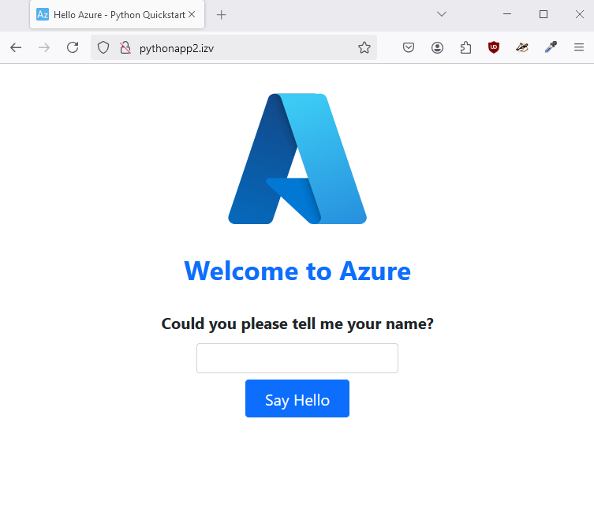

## Extracción de archivos

Viendo que todo ha funcionado correctamente, se procede a extraer los archivos necesarios para crear la provisión de forma completa:
```bash
sudo cp /var/www/pythonApp/.env /vagrant

sudo cp /var/www/pythonApp/application.py /vagrant/app1
sudo cp /var/www/pythonApp/wsgi.py /vagrant/app1
sudo cp /etc/systemd/system/flask_app.service /vagrant/app1
sudo cp /etc/nginx/sites-available/app.conf /vagrant/app1

sudo cp /var/www/msdocs-python-flask-webapp-quickstart/wsgi.py /vagrant/app2
sudo cp /etc/systemd/system/flask_app2.service /vagrant/app2
sudo cp /etc/nginx/sites-available/app2.conf /vagrant/app2
```

### Actualización de Vagrantfile

En este punto se ha actualizado la provisión en Vagrantfile.